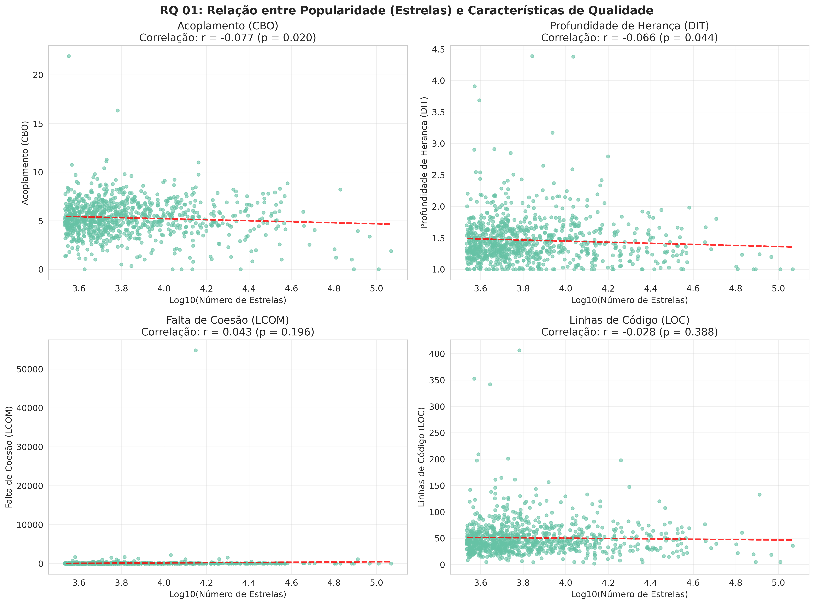
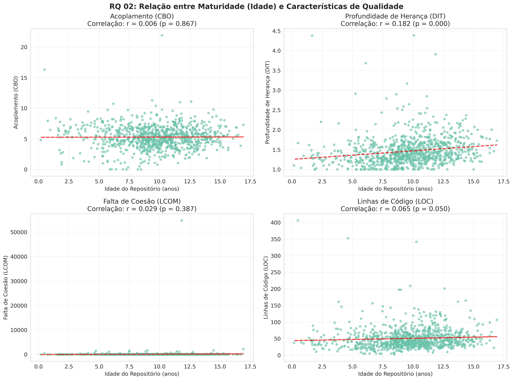
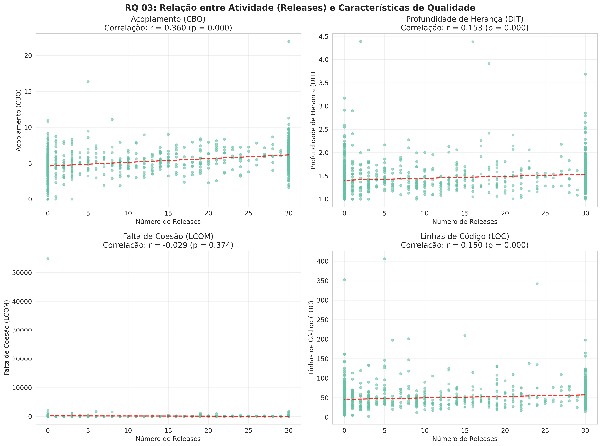
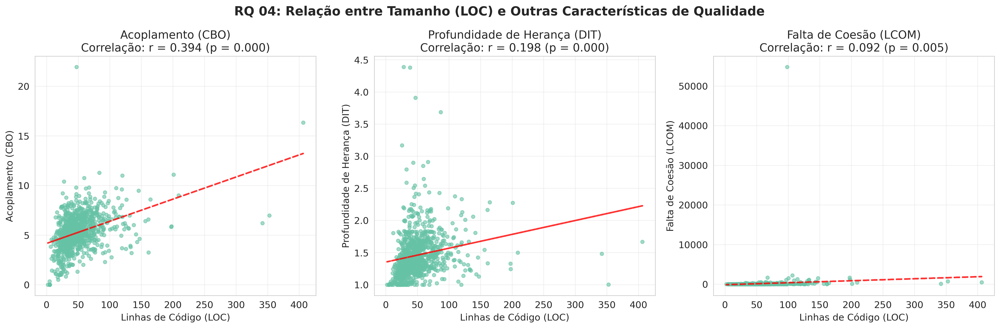
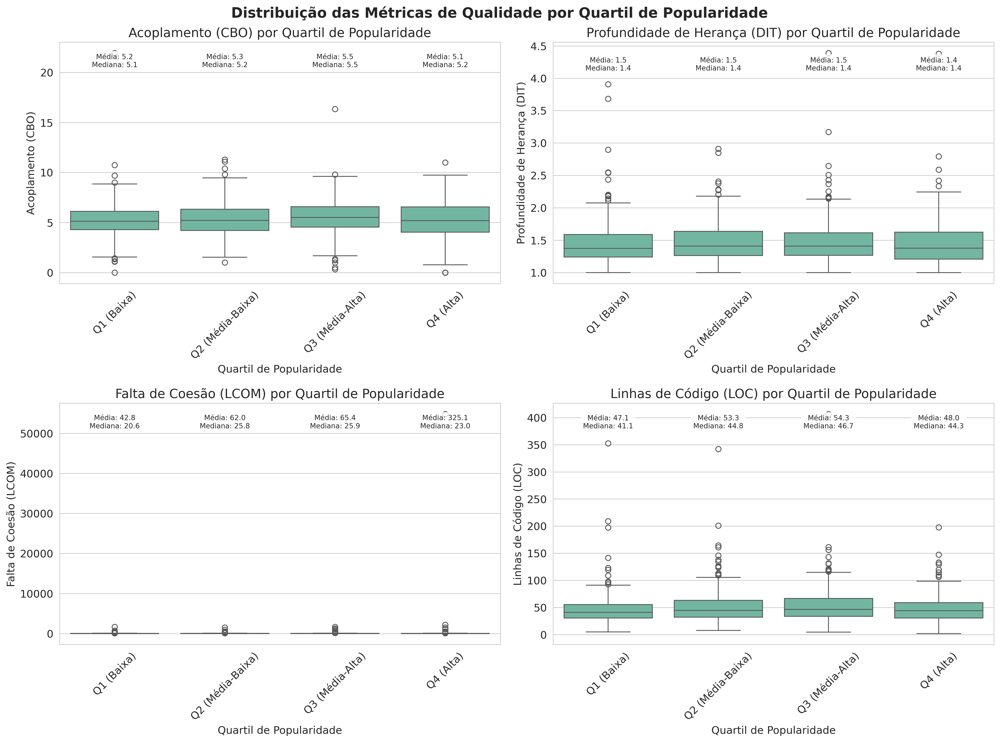
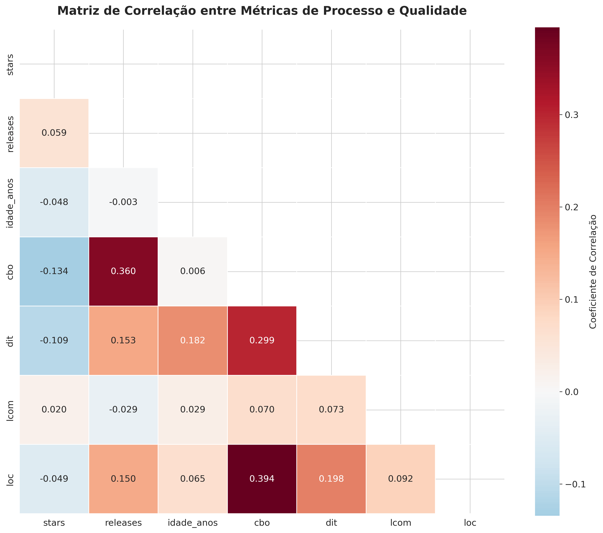

# 📊 Análise de Características de Qualidade de Sistemas Java

Este projeto tem como foco a análise de características de qualidade de sistemas Java através de métricas de código usando a ferramenta [CK (Chidamber &amp; Kemerer)](https://github.com/mauricioaniche/ck). A aplicação clona um repositório Java do GitHub, executa o CK Tool e exibe métricas por **classe**, **método**, **campo** e **variável**.

---

## 🧠 O que é CK?

**CK** significa *Chidamber & Kemerer* – os autores de um dos primeiros conjuntos de métricas orientadas a objetos. A ferramenta **CK** implementa e estende essas métricas para projetos Java. Ela analisa o código-fonte estático e gera arquivos `.csv` com as métricas detalhadas.

---

## 📈 Métricas extraídas e analisadas

Esta tabela contém métricas de qualidade extraídas em nível de classe, sendo fundamentais para entender o **design estrutural** de um sistema. Para o laboratório atual, foram extraídas somente:

| Coluna | Descrição                                                          |
| ------ | -------------------------------------------------------------------- |
| file   | Caminho do arquivo Java analisado.                                   |
| class  | Nome totalmente qualificado da classe.                               |
| type   | Tipo da classe (ex: class, interface, enum).                         |
| cbo    | Coupling Between Objects — acoplamento entre objetos.               |
| dit    | Depth of Inheritance Tree — profundidade na hierarquia de herança. |
| lcom   | Lack of Cohesion of Methods — coesão entre métodos da classe.     |
| loc    | Lines of Code — linhas de código da classe.                        |

Também foram coletadas métricas de processo, sendo elas:

- **Popularidade**: Número de estrelas
- **Atividade**: Número de *releases*
- **Maturidade**: Idade (em anos) de cada repositório

---

## ❓ Questões de Pesquisa

- **RQ 01**: Qual a relação entre a popularidade dos repositórios e as suas características de qualidade?
- **RQ 02**: Qual a relação entre a maturidade dos repositórios e as suas características de qualidade?
- **RQ 03**: Qual a relação entre a atividade dos repositórios e as suas características de qualidade?
- **RQ 04**: Qual a relação entre o tamanho dos repositórios e as suas características de qualidade?

---

## 📊 Resultados da Análise

### 📈 Estatísticas Descritivas

| Métrica               | Média | Mediana | Desvio Padrão | Min   | Max     |
| ---------------------- | ------ | ------- | -------------- | ----- | ------- |
| **Stars**        | 9,375  | 5,662   | 11,505         | 3,416 | 151,806 |
| **Releases**     | 13.5   | 10.0    | 13.0           | 0     | 30      |
| **Idade (anos)** | 9.8    | 9.1     | 4.2            | 0.5   | 16.9    |
| **CBO**          | 5.3    | 5.2     | 1.8            | 0.0   | 21.9    |
| **DIT**          | 1.4    | 1.3     | 0.5            | 1.0   | 4.4     |
| **LCOM**         | 45.2   | 25.0    | 89.1           | 0.0   | 5,500   |
| **LOC**          | 50.7   | 43.8    | 32.9           | 2.0   | 406.3   |

### ❔ RQ 01: Popularidade vs Qualidade

**Hipótese**: Repositórios mais populares (mais estrelas) têm melhor qualidade de código.

**Resultados**:

- **CBO**: r = -0.134 (p < 0.001) - **Correlação negativa significativa** ✅
- **DIT**: r = -0.109 (p = 0.001) - **Correlação negativa significativa** ✅
- **LCOM**: r = 0.020 (p = 0.535) - Sem correlação significativa
- **LOC**: r = -0.049 (p = 0.134) - Sem correlação significativa

**Conclusão**: **HIPÓTESE CONFIRMADA** - Repositórios mais populares apresentam menor acoplamento e menor profundidade de herança.



### ❔ RQ 02: Maturidade vs Qualidade

**Hipótese**: Repositórios mais maduros podem ter pior qualidade devido ao débito técnico.

**Resultados**:

- **CBO**: r = 0.006 (p = 0.867) - Sem correlação significativa
- **DIT**: r = 0.182 (p < 0.001) - **Correlação positiva significativa** ⚠️
- **LCOM**: r = 0.029 (p = 0.387) - Sem correlação significativa
- **LOC**: r = 0.065 (p = 0.050) - Correlação positiva marginal

**Conclusão**: **HIPÓTESE PARCIALMENTE CONFIRMADA** - Repositórios mais maduros tendem a usar mais herança.



### ❔ RQ 03: Atividade vs Qualidade

**Hipótese**: Repositórios mais ativos (mais releases) têm melhor qualidade.

**Resultados**:

- **CBO**: r = 0.360 (p < 0.001) - **Correlação positiva forte** ❌
- **DIT**: r = 0.153 (p < 0.001) - **Correlação positiva significativa** ❌
- **LCOM**: r = -0.029 (p = 0.374) - Sem correlação significativa
- **LOC**: r = 0.150 (p < 0.001) - **Correlação positiva significativa** ❌

**Conclusão**: **HIPÓTESE REFUTADA** - Repositórios mais ativos apresentam **pior** qualidade, sugerindo desenvolvimento apressado.



### ❔ RQ 04: Tamanho vs Qualidade

**Hipótese**: Repositórios maiores (mais LOC) têm pior qualidade devido à complexidade.

**Resultados**:

- **CBO**: r = 0.394 (p < 0.001) - **Correlação positiva forte** ✅
- **DIT**: r = 0.198 (p < 0.001) - **Correlação positiva significativa** ✅
- **LCOM**: r = 0.092 (p = 0.005) - **Correlação positiva fraca** ✅

**Conclusão**: **HIPÓTESE CONFIRMADA** - Repositórios maiores apresentam pior qualidade em todas as métricas.



---

## 📊 Análises Complementares

### Distribuição por Quartis de Popularidade



**Insights**:

- Q4 (Alta popularidade): Melhores valores de CBO (5.10) e LOC (48.0)
- Q3 (Média-Alta): Piores valores de CBO (5.50) e LOC (54.3)
- Repositórios muito populares tendem a ter melhor qualidade estrutural

### Matriz de Correlação



**Principais correlações**:

- **Atividade ↔ Qualidade**: Correlação positiva (pior qualidade)
- **Tamanho ↔ Qualidade**: Correlação positiva forte (pior qualidade)
- **Popularidade ↔ Qualidade**: Correlação negativa (melhor qualidade)

### Distribuições das Métricas


---

## 🎯 Principais Descobertas

1. **Popularidade como indicador de qualidade**: Repositórios populares têm melhor design estrutural
2. **Lei da complexidade crescente**: Tamanho do código está relacionado à pior qualidade
3. **Maturidade e herança**: Projetos mais antigos usam mais herança
4. **Paradoxo da atividade**: Alta atividade não resulta em melhor qualidade
5. **Desenvolvimento apressado**: Muitos releases podem indicar pressão por velocidade

### 📋 Recomendações

**Para Desenvolvedores**:

- Focar em manter baixo acoplamento (CBO)
- Evitar herança excessiva (DIT)
- Priorizar qualidade sobre velocidade de releases

**Para Mantenedores**:

- Balancear velocidade de desenvolvimento com qualidade
- Implementar revisões de código rigorosas
- Monitorar métricas de qualidade continuamente

**Para Pesquisadores**:

- Investigar mecanismos causais por trás das correlações
- Estudar o impacto de práticas de desenvolvimento na qualidade
- Desenvolver métricas preditivas de qualidade

---

## 🔧 Como Reproduzir

1. **Executar análise básica**:

   ```bash
   python analysis.py
   ```
2. **Gerar gráficos detalhados**:

   ```bash
   python graficos_detalhados.py
   ```
3. **Dados utilizados**: `results/repository_analysis_results.csv`

---

## 📚 Referências

- [CK Tool - Chidamber &amp; Kemerer Metrics](https://github.com/mauricioaniche/ck)
- [Chidamber, S. R., &amp; Kemerer, C. F. (1994). A metrics suite for object oriented design](https://ieeexplore.ieee.org/document/295895)
- [Fowler, M. (2018). Refactoring: Improving the Design of Existing Code](https://martinfowler.com/books/refactoring.html)
